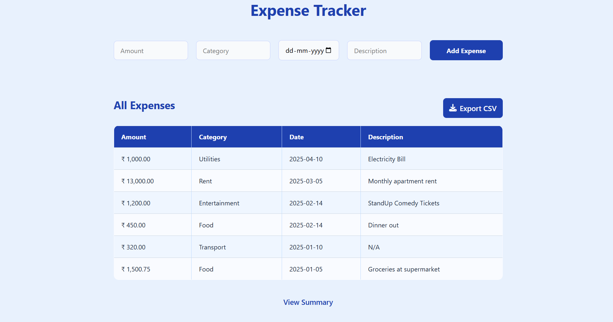
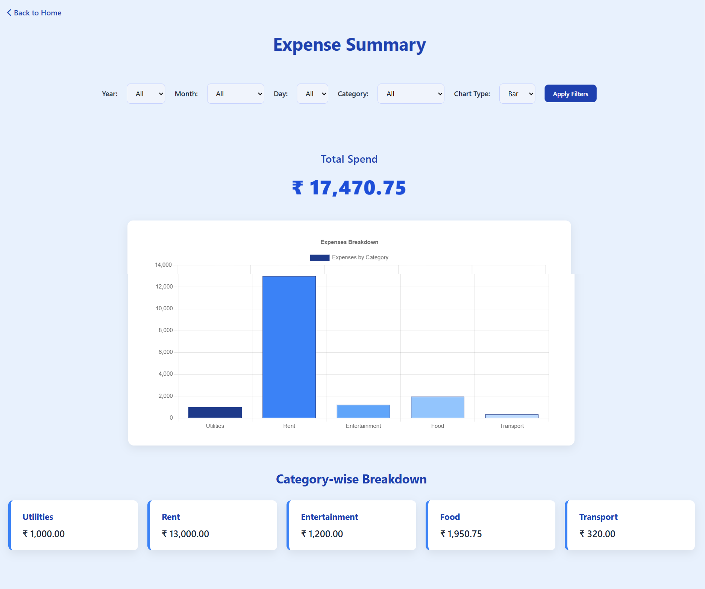

# Expense Tracker (FastAPI + SQLModel)

A modern, responsive web-based **Expense Tracker** that helps you record, view, and analyze your expenses by category and date built using **FastAPI**, **SQLModel**, and **Chart.js**.

---

## ✨ Features

- Add expenses with amount, category, date, and description
- View all expenses in a clean, styled table
- Visual summary with filterable bar, pie, or line chart
- Filter by year, month, day, and category
- Export all expenses to CSV
- Mobile-responsive design
- Built using FastAPI & SQLModel with Jinja2 templates

---

## 🛠 Project Setup

### 1. Clone the Repository

```bash
git clone https://github.com/Ranjan5567/ExpenseTracker.git
cd expense-tracker
```

### 2. Create a Virtual Environment

```bash
python -m venv .venv
```

### 3. Activate the Environment

On Windows:

```bash
.venv\Scripts\activate
```

On macOS/Linux:

```bash
source .venv/bin/activate
```

### 4. Install Dependencies

```bash
pip install -r requirements.txt

```

## ▶️ Running the App

Start the development server:

```bash
uvicorn app.main:app --reload
```

## Accessing the App

👉 [http://127.0.0.1:8000](http://127.0.0.1:8000)

## Carrying Unit tests

```bash
pytest tests/test_expenses.py
```

# Screenshots



